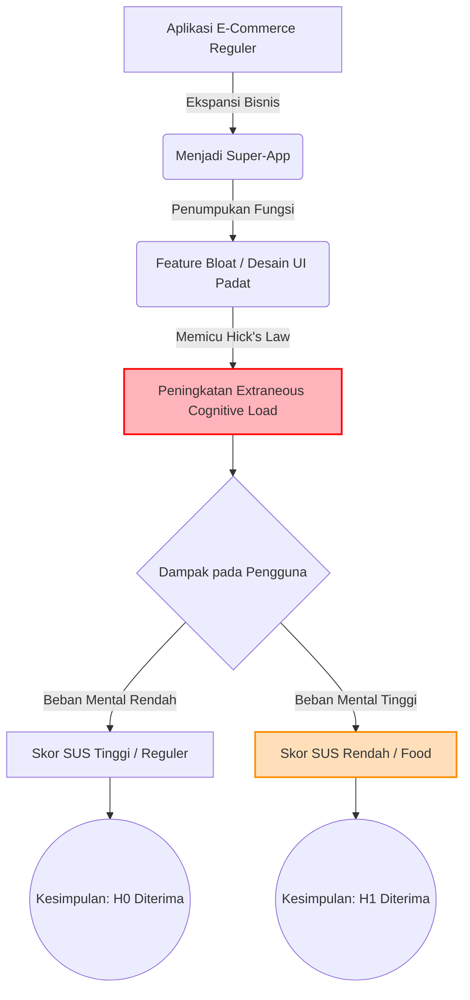

# Kerangka Teori & Konseptual

Penelitian ini dilandasi oleh tiga grand theory utama dalam ranah Interaksi Manusia dan Komputer (HCI) dan Psikologi Kognitif. Berikut adalah penjelasan teori beserta model konseptual dari penelitian ini.

## 1. Konsep *Super-App* dan *Feature Bloat*

*Super-App* adalah evolusi dari aplikasi tunggal menjadi sebuah ekosistem digital (platform) yang mewadahi berbagai layanan mikro di dalamnya (misal: belanja, pengiriman makanan, dompet digital, hingga hiburan). 

**Dampak Negatif (*Feature Bloat*):** 
Ketika *developer* memaksakan terlalu banyak fungsi sekunder ke dalam antarmuka aplikasi utama tanpa melakukan *redesign* struktural, antarmuka akan menderita *feature bloat* (penggelembungan fitur). Hal ini ditandai dengan munculnya banyak ikon, *banner* promo, dan menu navigasi yang saling berdesakan dalam satu layar *smartphone* yang sempit.

## 2. Teori Beban Kognitif (*Cognitive Load Theory* & *Hick's Law*)

### A. Cognitive Load Theory (Sweller, 1988)
Teori ini menyatakan bahwa *Working Memory* (memori kerja) manusia memiliki kapasitas pemrosesan informasi yang sangat terbatas. Terdapat tiga jenis beban:
1. **Intrinsic Load:** Tingkat kesulitan tugas itu sendiri (misal: mencari makanan yang diinginkan).
2. **Extraneous Load:** Beban tak berguna akibat desain antarmuka yang buruk (misal: terdistraksi *banner* promo yang bergerak, warna-warni berlebihan, menu yang membingungkan).
3. **Germane Load:** Beban kognitif yang dikerahkan untuk membangun pola memori jangka panjang.

*Feature bloat* pada Shopee Food meningkatkan **Extraneous Load** secara dramatis, sehingga pengguna kelelahan sebelum tugas utama mereka (memesan makanan) selesai.

### B. Hick's Law (1952)
*Hick's Law* mempostulatkan bahwa **waktu dan usaha yang dibutuhkan seseorang untuk mengambil keputusan akan meningkat secara logaritmik setiap kali jumlah pilihan ditambah**. Pada UI Shopee, setiap penambahan ikon layanan baru berarti menambah sekon waktu bagi pengguna (terutama fungsi otak pemrosesan visual) untuk menemukan apa yang sebenarnya mereka cari.

## 3. System Usability Scale (SUS)

Diciptakan oleh John Brooke (1996), SUS adalah instrumen pengukuran persepsi kemudahan penggunaan (usability) yang berbentuk 10 pernyataan (5 pernyataan positif dan 5 pernyataan negatif) berskala Likert 1-5.

Kriteria penilaian SUS (Bangor et al., 2008):
- **< 50** : *Not Acceptable* (Sistem butuh perombakan total)
- **50 - 70** : *Marginal* (Bisa digunakan, tapi menyulitkan)
- **> 70** : *Acceptable* (Sistem baik dan mudah digunakan)

## 4. Model Konseptual Penelitian

Berikut adalah diagram pemetaan bagaimana teori-teori di atas membentuk hipotesis penelitian ini, diilustrasikan dengan diagram Mermaid:

**Penjelasan Alur:** 
Transisi Shopee menjadi *Super-App* melahirkan penumpukan fungsi *(feature bloat)*. Hal ini menaikkan beban mental pengguna *(Extraneous Cognitive Load)*. Melalui instrumen SUS, eksperimen ini membuktikan bahwa alur turunan (Shopee Food) memberikan beban mental yang lebih tinggi sehingga memicu terjunnya skor SUS menuju level *Not Acceptable* (< 50).
